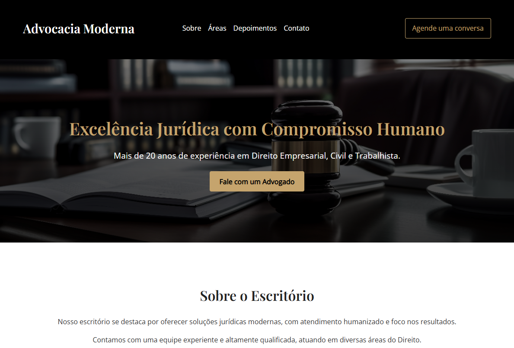

# 🧑‍⚖️ Advocacia Moderna — Website Responsivo

Site institucional moderno e responsivo para um Escritório de Advocacia. Desenvolvido com foco em experiência do usuário (UX), estética refinada (UI), e otimização para conversão de leads.

## 📌 Funcionalidades

- Design 100% responsivo (mobile-first)
- Hero section com CTA
- Seções: Sobre, Áreas de Atuação, Depoimentos, Contato
- Estilo elegante com paleta preto/dourado/branco
- Formulário de contato e botão WhatsApp
- Otimizado para SEO e redes sociais (Open Graph)


## 📸 Screenshot



[👉 Clique aqui para visitar a página](https://landing-page-advocacia-moderna.vercel.app/)

## 🎨 Tecnologias Utilizadas

- HTML5
- CSS3 (vanilla)
- Google Fonts: *Playfair Display* e *Open Sans*
- Favicon personalizado em SVG
- Estrutura modular e clara para futuras integrações

## 🚀 Como Usar

1. Clone o repositório:

```bash
git clone https://github.com/seuusuario/advocacia-site.git
```

2. Abra o arquivo `index.html` no navegador:

```bash
cd advocacia-site
open index.html  # ou apenas clique duas vezes no arquivo
```

## ✅ Melhorias Futuras

- Integração com backend para envio de formulários (EmailJS ou Node)
- Área de blog/jurisprudência com foco em SEO

## 📄 Licença

Este projeto está licenciado sob a licença MIT. Veja o arquivo [LICENSE](LICENSE) para mais detalhes.

## 📩 Contato
Se quiser adaptar este projeto para seu negócio, entre em contato comigo por e-mail ou pelas redes sociais:

- ✉️ ivannatech@gmail.com
- 💼 [LinkedIn](https://www.linkedin.com/in/ivanna-almeida/)
- 🖥️ [GitHub](https://github.com/ivannatech)

---

> Este projeto é parte de um portfólio de desenvolvedora web freelancer e está disponível para uso não-comercial ou como base para novos projetos personalizados.